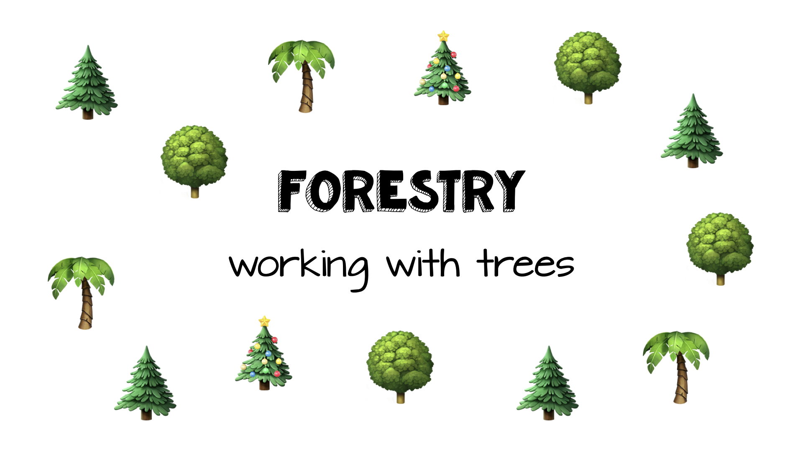
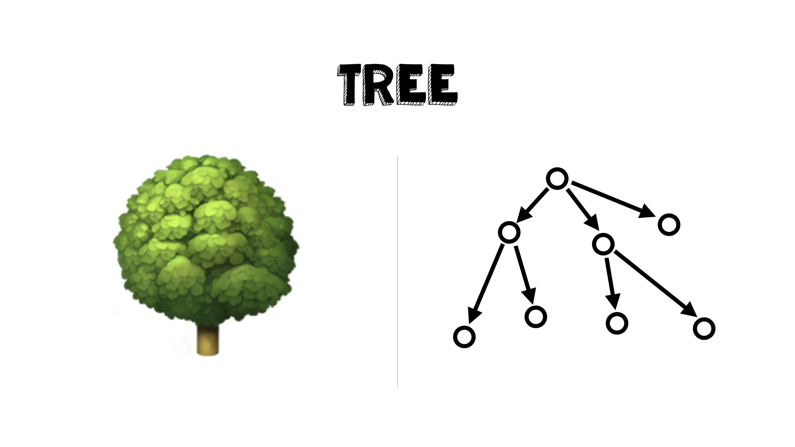
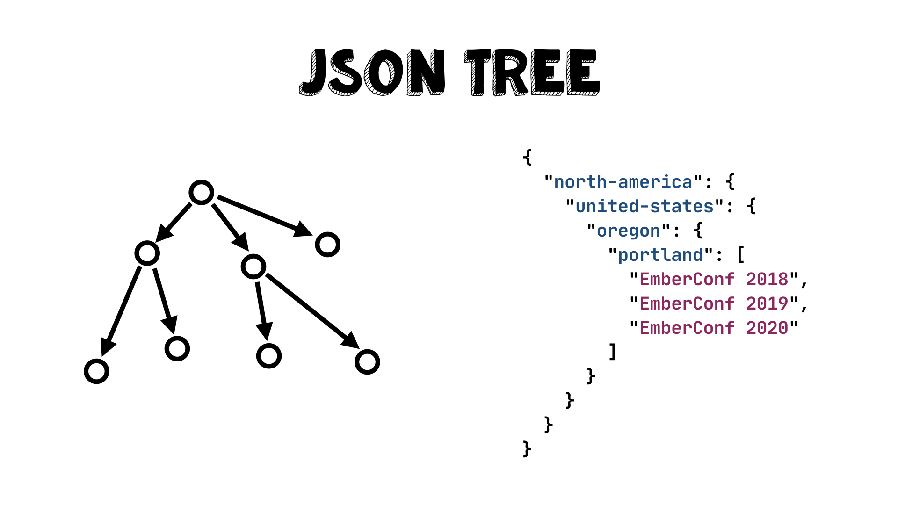
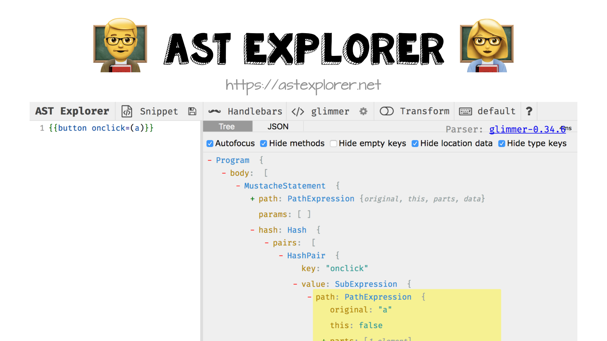
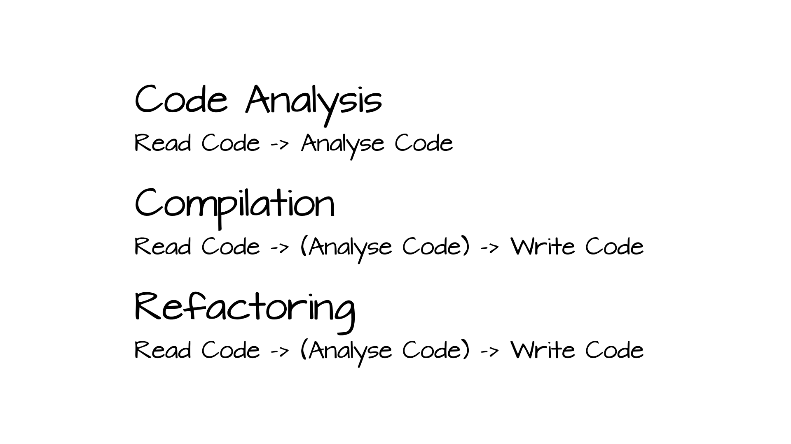
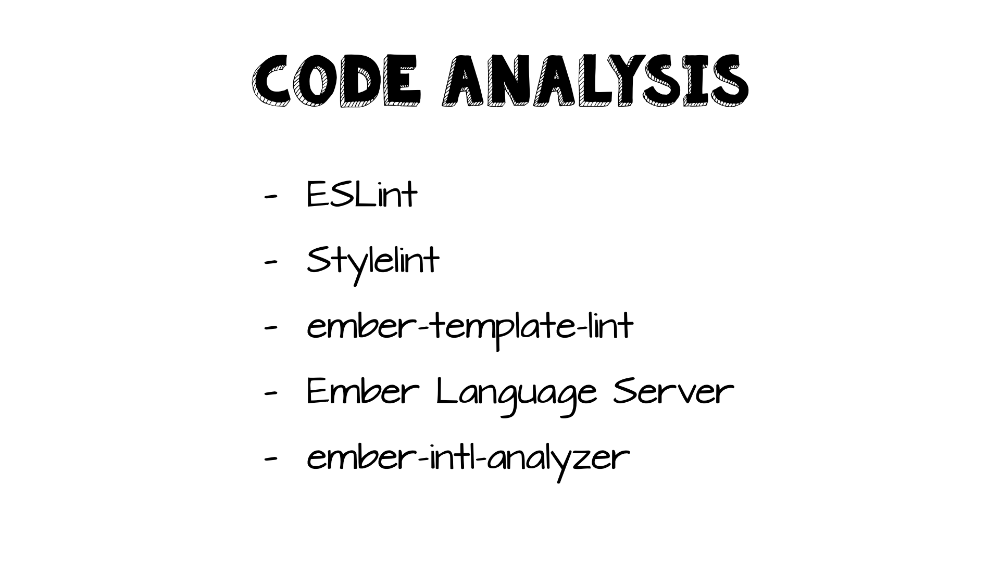
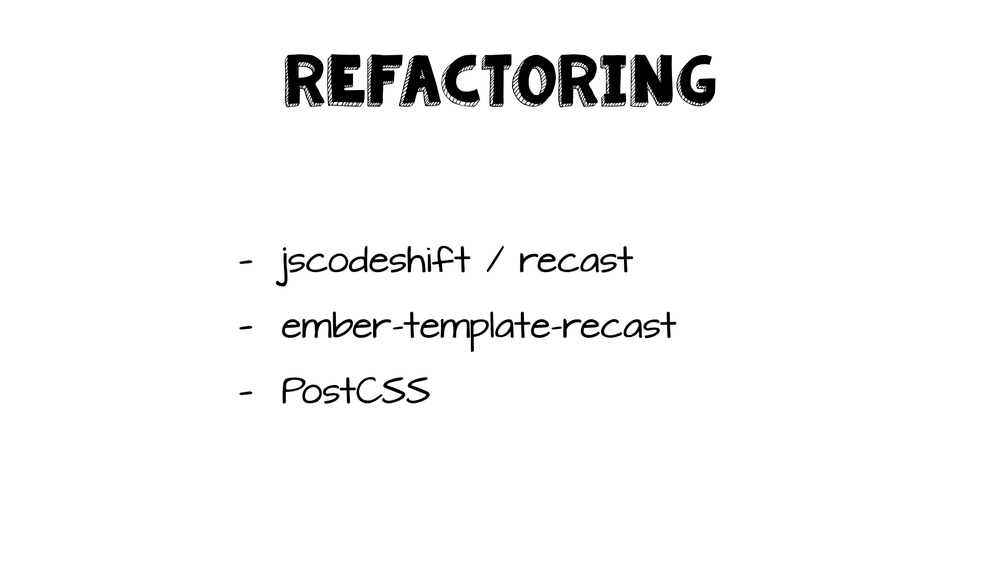
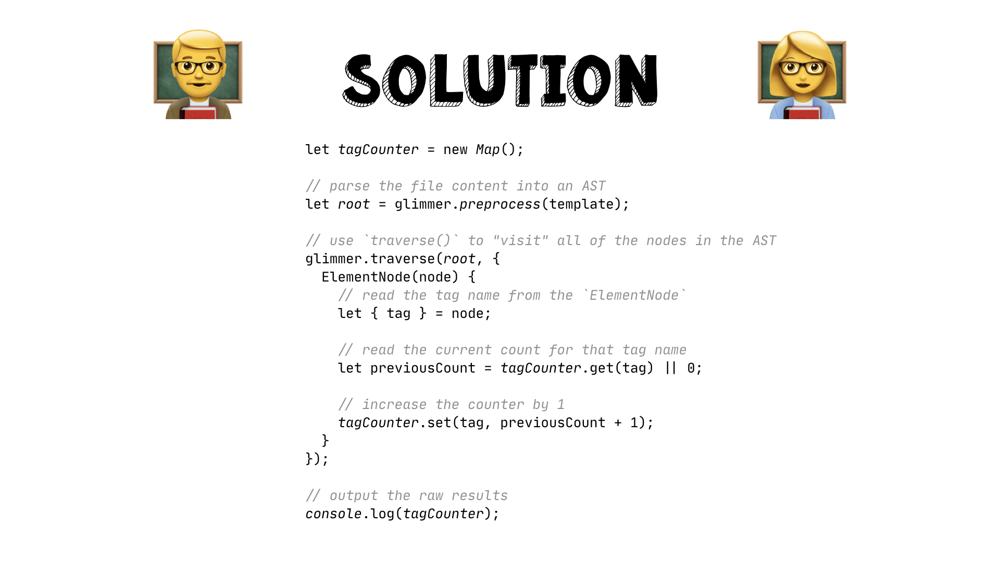
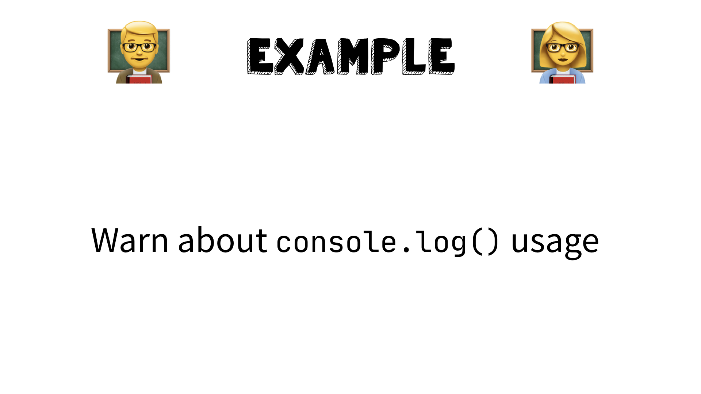

# Abstract Syntax Forestry

An EmberConf 2020 workshop from [simplabs](https://simplabs.com/) to teach you
the basics about Abstract Syntax Trees.


## 

Hello everyone and welcome to this workshop which I titled "Abstract Syntax
Forestry".

Since probably not everyone doing this workshop is a native speaker and
immediately understands this word play, let's quickly start with an intro
about what that title means.


## 

First of all, what does "Forestry" mean?

Any idea?

According to [Wikipedia](https://en.wikipedia.org/wiki/Forestry):

> **Forestry** is the science and craft of creating, managing, using,
conserving, and repairing forests, woodlands, and associated resources for human
and environmental benefits.

or in other words:


## 

**Forestry** means: working with trees!


## 

now... what is a **tree**?


## 

This is a **tree**!

But it's not the kind of tree we want to talk about in this workshop... 


## 

There is a certain type of data structure that is also called **tree**, because
depending on how you look at it, it roughly looks like a real tree. And some
other terminology (aka. words) also are borrowed from this metaphor. The
**tree** data structure has **leaf** elements, it has **branches** and it has a
**root** elements.

About that... what defines a **tree** data structure?


## 

First of all, a **tree** is a **graph** data structure, but a specific kind of
graph. The defining features are that a tree has exactly **one root element**
(at the top here), and that element can have 0, 1, 2, 1000, or even more, child
elements. And then each of those child elements can also have an arbitrary
number of child elements.

But, a child element can only ever have one parent element!

If you need something else to compare against: it is very roughly like a
recursive `belongsTo` relationship in Ember Data or any other relational
database/ORM kind of system.

Now that we have a rough understanding of what a **tree** is in theory, let's
get into a few real examples of where the **tree** data structure is being used.

Any ideas?

(yes, I realize that in this format you've likely already had a glimpse of the
next slide 😅)


## 

One example of a **tree** structure that we use all the time is: JSON.

JSON has a very limited number of data types and arrays and objects are the
only ones that can have children. An array can have 0, 1, 1000, or more
elements in it. And an object can also have 0, 1, 1000, or more keys with
their associated values in it.

And then there is the constraint of having a single root element. If you look
at a JSON file, you can see that it always either has a single object or array
as the main element in the file, and if you try to put a second thing in the
file it will result in a syntax error.

That means, similar to how trees are a specific kind of **graph** data
structure, we can consider JSON to be a specific kind of **tree** data
structure.


## 

Another real-world example is HTML. In HTML you have the root `<html>` element,
and that can have multiple children, though in reality it only supports `<head>`
and `<body>`. But those then can also have an arbitrary number of child
elements.


## 

You can see on the right side of the above slide how the tree structure of
the HTML file on the left side could be represented.

If you feel reminded of the DOM (document object model) in the browser, that is
no coincidence. The browser also parses the HTML file into such a tree
structure and then exposes it to JavaScript as the DOM.


## 

So far we've only been talking about **trees**. But what about the other two
words in that workshop title? what does "abstract syntax" mean?


## 

In a very basic way, an "Abstract Syntax Tree" is a JSON object that
represents the code structure of a file.

As you can see in the slide, I've put asterisks (`*`) on the words "JSON" and
"code", because...


## 

While most parsers in the JavaScript ecosystem produce JSON-based ASTs, there
are quite a few parsers in other ecosystems that don't use JSON. Since this
workshop assumes that most of you are working primarily with JavaScript we will
focus on JSON-based ASTs here for now.

Please note that the general concept will still be roughly the same, whether
the parser produces JSON, or not.


## 

The other asterisk was on "code". Because while ASTs are mostly used for code
there are also some other file parsers that can produce ASTs.

Take our earlier example of HTML. HTML is a subset of XML, and XML can be used
for regular data files. But a lot of HTML parsers that produce ASTs can handle
XML, so you can easily convert an XML data file into an AST.

But enough of all this theoretical talk, let's look at an example!


## 

There is a great tool on the internet that I would like to introduce you to,
and it's called **AST Explorer**.

You can find it at <https://astexplorer.net>.

If you've never opened it before it will start you on the default view,
with an example JavaScript file on the left side, and the corresponding
syntax tree on the right side.

You can notice that when you click on something in the left panel it will
automatically focus the corresponding syntax tree element in the right panel,
and similarly, if you hover over something in the right panel it highlights
the corresponding characters on the left. (if it does not do that, check if you
have the "Autofocus" checkbox enabled on the right side of the screen)

Where it gets interesting is when you move your cursor over the "JavaScript"
button in the menu bar at the top. Here, you should see a dropdown menu of all
the available languages that the AST Explorer understands. If you look closely,
you can see that it also supports **Handlebars**, which is what we will be
focusing on for this first bit of the workshop.

If you click on "Handlebars" you will see that the snippet in the left panel
has changed to a small example template, and the right panel is now also
showing something different: the Handlebars syntax tree.

In case you're wondering "where is the JSON that we talked about?", have a look
at the "Tree | JSON" tab bar on the right side of the screen. If you click on
"JSON" you can see the raw JSON data, while the "Tree" view shows a slightly
more ergonomic view of the same data.


## 

Let's start with the first exercise!

I invite you to click around a bit in the AST Explorer and when you feel
comfortable try to answer the three questions above.

If you don't know what an **element modifier** is I would recommend to first
have a look at the [Ember.js Guides](https://guides.emberjs.com/release/components/template-lifecycle-dom-and-modifiers/)
that explain what they are and what they can be used for.

To get started you can modify the example template on the left side of the
screen to match the snippet below:

```hbs
<div class="entry">
  <h1>{{title}}</h1>
  <div class="body">
    {{body}}
  </div>
  <button type="button" {{on "click" this.onNext}}>Next</button>
</div>
```

<details>
 <summary>Solution 1</summary>

> what is the node type of and element modifier in handlebars templates?

To solve this first exercise we need to click on the `on` in 
`{{on "click" this.onNext}}`, which will focus a `PathExpression` element in the
AST. You can see that this `PathExpression` belongs to the `path` attribute of
the parent element and that element has the `type` attribute
`ElementModifierStatement`

And that is already the answer to our first question "what is the node type of
and element modifier in handlebars templates?":

The node `type` of an element modifier is `ElementModifierStatement`
</details>

<details>
 <summary>Solution 2</summary>

> what other attributes does a modifier have?

For this question we keep our focus on the `ElementModifierStatement` node in
the AST. We've already seen that the element has a `type`
(`ElementModifierStatement`) and a `path` (a `PathExpression` with `on`), but
there are also some other attributes here:

- `params` holds a list of all the positional parameters (`"click"` and
  `this.onNext` in this case).

- `hash` holds information about named parameters. for example the [`on`
  modifier](https://api.emberjs.com/ember/3.17/classes/Ember.Templates.helpers/methods/on?anchor=on)
  that we're using in this example supports a named parameter called `passive`,
  that can be used like this: `{{on "click" this.onNext passive=true}}`

Depending on the state of the "Hide location data" checkbox in the AST Explorer
you can also see a `loc` attribute. This attribute tells us where in the
template file this AST node starts and ends. This information is for example
used by the AST Explorer to highlight the correct characters when we hover over
the nodes in the panel on the right side.
</details>

<details>
 <summary>Solution 3</summary>

> how are modifiers assigned to their parent node?

To answer this last question of the exercise we need to look at the parent node
of our `ElementModifierStatement`. You can see that the
`ElementModifierStatement` node is part of an array, which makes sense, because
an element in Handlebars can have multiple modifiers at the same time.

That array of element modifiers is assigned to the `modifiers` key of the
`ElementNode` parent element, and that is already the answer that we're looking
for: `modifiers`.
</details>

## 

Alright, after this first exercise let's see what all this is actually useful
for.

Any ideas? 

## 

Asking this without you seeing the answer already on the next slide would
obviously work much better, but let's pretend that someone in the room had
raised their hand and answered one or more of these things... 😉

There are generally three categories of tools that we can build using ASTs.

The first category is **code analysis tools**. Basically tools that parse code files
into ASTs and then analyze the code via the AST. Some tools might analyze the
code directly as characters, but it is usually waaay easier if you can work with
the code in a more structured way.

The second category are **compilers**. These kinds of tools take your code, parse
it, convert it into something different that a machine can execute and then
write it out again.

Don't worry if this sounds complicated or abstract, we'll get to some example
in just a few seconds... depending on how fast you can read... 😄

The third category can be named **refactoring** tools, or sometimes also
referred to as **codemods**. These tools read your code, adjust it in some way
and write it out again.

## 

At this point you might be thinking: "wait, the second and third category sound
almost the same... what's the difference?"

And you are absolutely correct that the lines are a little blurry here.

## 

The main difference between the two categories is that compilation tools write
the output in a way that is optimized for machines to read it, with often a lot
of optimizations that make the resulting code quite unreadable.

Refactoring tools however try to keep the output as close to the input as
possible, so that the developers are still able to read the code in an easy way.

## 

I promised you examples, so let's go through all three of these categories and
find a few examples.

As you can see the slide above is blank again, which is usually the trigger for
you to come up with a few answers yourself before we continue.

...

...

...

Alright, let's see what our example list has on it.

## 

The most famous code analysis tool in the JavaScript ecosystem right now is
[ESLint](https://eslint.org/).

Something similar also exists to analyze CSS and SASS files and it is called
[stylelint](https://stylelint.io/).

And then we also have a bunch of code analysis tools from the Ember.js ecosystem
specifically, like [ember-template-lint](https://github.com/ember-template-lint/ember-template-lint/),
the [Ember Language Server](https://github.com/emberwatch/ember-language-server),
and [ember-intl-analyzer](https://github.com/simplabs/ember-intl-analyzer).


## 

The next category is "Compilation".

One famous compiler is `gcc`, which can be used to turn C and C++ code into
machine code that can run on your computer.

But we want to focus on the JavaScript ecosystem here...

## 

You probably know it under the name "transpiler" instead of "compiler", but
[Babel](https://babeljs.io/) fits our definition quite well. It's mostly called
transpiler because it happens to compile the input language, JavaScript, to
the same output language, JavaScript.

Another example that is again more CSS focused is [SASS](https://sass-lang.com/),
which compiles SASS files to CSS files.

[PostCSS](https://postcss.org/) goes in a similar direction, but here you could
also call it a transpiler since it compiles CSS into CSS.

Another example is [UglifyJS](https://github.com/mishoo/UglifyJS), which
compiles JavaScript into minified JavaScript. The code after the compilation
still does the same thing, but it's optimized for machines to execute, and no
longer for humans to read or edit.

And looking more into the Ember.js ecosystem, we have the [Glimmer](https://github.com/glimmerjs/glimmer-vm/)
template compiler, which turns our Handlebars templates into code that runs
directly in the browser.


## 

If we look a little closer here, we can see that a lot of these compilers are
actually built out of a number of smaller plugins that can be enabled or
disabled as we want. This is similar to how you can turn on and off certain
rules in your ESLint or ember-template-lint config files.


## 

Finally, the last category: Refactoring

If you haven't built a codemod before it's unlikely that you know these tools
so let's jump right to the list of examples.


## 

If you want to build a codemod that modifies JavaScript files then the best
solution is currently [jscodeshift](https://github.com/facebook/jscodeshift),
which is built on top of [recast](https://github.com/benjamn/recast), and gives
it a more jQuery-like API.

For Handlebars templates the awesome [Robert Jackson](https://github.com/rwjblue/)
has built something similar, which is called [ember-template-recast](https://github.com/ember-template-lint/ember-template-recast).
Something like jscodeshift does not yet exist for it, but I've seen some early
prototypes and the future looks bright! 😊

And then the last tool on this list is something that we've already seen before:
PostCSS

PostCSS is in some sense a special case because it largely preserves the input
formatting by default, but is also regularly used as a transpiler. We won't
focus on PostCSS in this workshop, but if you ever want or need to write a
codemod in the future that needs to touch CSS then I would recommend to have a
look at PostCSS.


## 

Alright, now that we have all of that out of the way, let's see how we can apply
what we just learned. The rest of this workshop will mostly be examples and
exercises. The examples we'll go through together, and the exercise you're
supposed to solve by yourself, but if you run into any blocking issues feel free
to ask questions or have a look at the solution.

Also, now would be a good time to take a short coffee or toilet break, and after
that we'll dive into the chapter "Code Analysis with `@glimmer/syntax`"!

(and if you haven't done it yet, this small break would also be a great time to
run `yarn install` in the root folder of this repository 😉)


## 

In this first example exercise the goal is to count how often each HTML tag
(like `<h1>` or `<div>`) and component name (like `<LinkTo>`) is used in a
Handlebars template.

To make things a little easier I've prepared a small Node.js script for us
that reads all of the template files in an example app and makes it easier
for us to analyze the templates.

You can find the example app in the `02-count-tags` folder, and the script is
at `count-tags.js`. If you run it now, you will see something like:

```
$ node count-tags.js
Map {}
```

This is unsurprising because we haven't written any code yet and nothing is
filling the `tagCounter` map yet that we're outputting at the end of the script.


## 

Let's look at the solution together. I've included it as copy-pasteable code
below, but I would recommend that you try to type it yourself so that the
following exercises will be easier to follow.

<details>
 <summary>Solution</summary>

```js
const fs = require('fs');
const globby = require('globby');
const glimmer = require('@glimmer/syntax');

let tagCounter = new Map();

// find all template files in the `app/` folder
let templatePaths = globby.sync('app/**/*.hbs', {
  cwd: __dirname,
  absolute: true,
});

for (let templatePath of templatePaths) {
  // read the file content
  let template = fs.readFileSync(templatePath, 'utf8');

  // parse the file content into an AST
  let root = glimmer.preprocess(template);

  // use `traverse()` to "visit" all of the nodes in the AST
  glimmer.traverse(root, {
    ElementNode(node) {
      // read the tag name from the `ElementNode`
      let { tag } = node;

      // read the current count for that tag name
      let previousCount = tagCounter.get(tag) || 0;

      // increase the counter by 1
      tagCounter.set(tag, previousCount + 1);
    }
  });
}

// output the raw results
console.log(tagCounter);
```
</details>

There are a few things here to understand so take your time before you continue,
because all of what we will work on from now will build on these basics.

First of all, you can see that we import a package called `@glimmer/syntax`.
This package lives in the [glimmer-vm](https://github.com/glimmerjs/glimmer-vm/tree/master/packages/%40glimmer/syntax)
project and can be used to parse Handlebars files into JSON-based syntax trees.

The next interesting line is where we call `glimmer.preprocess(template)`. This
parses the file and returns a JSON object, or it will throw an error if the
template has a syntax error.

And please don't ask me why this function is called `preprocess()` instead of
something more straight-forward as `parse()`. I honestly don't know... 😅

Anyway, if, instead of continuing with the solution, you use `console.log(root);`
now, you will see that it looks roughly similar to the AST we've seen before in
the AST Explorer. But as you can also see, working with the raw JSON-based AST
can be a bit hard because it is often quite large. I can highly recommend to
have the AST Explorer open in a browser tab whenever you work on anything
AST-related.

For this example we can use the default snippet in the AST Explorer for now,
which we can restore by hovering over the "Snippet" menu item, and then
selecting "New" from the menu. If you're not in "Handlebars" mode, make sure
you select it from the languages menu before doing the above.

If you now click on one of the `<div>` elements or the `<h1>` you can see that
all HTML tags are represented by `ElementNodes`. And all of these `ElementNodes`
have an attribute `tag`, which is the tag name of the HTML element. The same is
also true for component invocations that use Angle Bracket Syntax like
`<LinkTo @route="index">Home</LinkTo>`.

If we want to count how often a tag is being used that means we need to look
at all of the `ElementNodes` in the AST and count how often the same `tag`
attribute appears.

But there is a problem... You can see that one of the `<div>` elements is
nested in the other one. And the AST reflects that, by also having a nested
structure. Now, we could write a bit of code that goes through every child
element of the `root` node, then every child element of those, and so on, but,
luckily, the Glimmer developers have already done that for us.

Let me introduce you to the `traverse()` function in the `@glimmer/syntax`
package. The way this works is by giving two arguments to the function: first,
the root element of the AST, and second, a JavaScript object. That JavaScript
object can contain callback functions for any or all of the AST node types that
we've encountered so far.

As a quick example, try the following code:

```js
glimmer.traverse(root, {
  ElementNode(node) {
    console.log(node);
  },
  AttrNode(node) {
    console.log(node);
  },
});
```

You can see that only AST nodes with the types `ElementNode` and `AttrNode` are
printed on the console.

For our specific example we only care about `ElementNodes` though. Inside of the
callback function we extract the `tag` attribute from the node, look at the
`tagCounter` map to figure out the previous count for this tag name and then
increase it by one. Finally, we print the content of `tagCounter` to the
console.

If everything worked you should see that there are currently 240 `<div>` tags
in this app, and e.g. `<LinkTo>` is used 95 times. 🎉


## 

This concludes our first example exercise. This next one you should first try
on your own and only once you solved it, or are really stuck you can click
on the "Solution".

The goal of this exercise is to use `console.log()` to warn about the confusing
pattern of using an `unless` condition with an `else` block.

As usual I have prepared a small script for us that can be used as a starting
point. This time the code is in the `03-no-unless-else` folder in the 
`find-unless-else.js` file.

If you need a first, initial hint: type the code snippet from the slide into the
AST Explorer first, and play around with it a little bit to figure out how we
can determine if the `unless` condition has an `else` block or not. Once you
have an idea try to use our knowledge from the last example to finish the
script file.

At the end, the output should look something like this:

```
$ node find-unless-else.js 
Found unless/else in app/components/crate-toml-copy.hbs:6:8
Found unless/else in app/templates/crate/owners.hbs:60:8
```

<details>
 <summary>Solution</summary>

By playing around in the AST Explorer we can see that the defining thing about
the `unless` block is that it is a `BlockStatement` with a `path` attribute that
is a `PathExpression` and has an `original` attribute of `unless.

So far, so good. Now we are able to find `unless` blocks in our templates, but
how can we figure out if the have an `else` block too?

If we play around some more in the AST Explorer by removing the `else` block
from the snippet, we can see that the `inverse` attribute of the
`BlockStatement` changes. When there is an `else` block we can see a `Block`
element for the `inverse` attribute, otherwise the `inverse` attribute is
`null`.

To recap, we need to find all `BlockStatements`, that have a `PathExpression`
with `original: 'unless'`, and have an `inverse` that is not `null`.

How can we find all `BlockStatements` in the template? By using the `traverse()`
function, similar to the previous example exercise:

```js
glimmer.traverse(root, {
  BlockStatement(node) {
    // TODO check for the other requirements and warn if they match
  },
});
```

Once we see a `BlockStatement` the callback function above will be called and
we now need to check if this `BlockStatement` is an `unless` block and if it has
an `else` block too:

```js
if (
  // first we make sure that `node.path` is really a `PathExpression`
  // since there are a few edge cases where it might not be
  node.path.type === 'PathExpression' &&

  // then we check if this is an `unless` block
  node.path.original === 'unless' &&

  // and finally, we check if the block has an `else` block too
  node.inverse
) {
  // TODO print warning
}
```

I'll leave it up to you how exactly to print the warning. Below is an example
that I came up with that includes the filename, line number and also the column
at which the `unless` block is found:

```js
const fs = require('fs');
const globby = require('globby');
const glimmer = require('@glimmer/syntax');

// find all template files in the `app/` folder
let templatePaths = globby.sync('app/**/*.hbs', {
  cwd: __dirname,
  absolute: true,
});

for (let templatePath of templatePaths) {
  // read the file content
  let template = fs.readFileSync(templatePath, 'utf8');

  // parse the file content into an AST
  let root = glimmer.preprocess(template);

  // use `traverse()` to "visit" all of the nodes in the AST
  glimmer.traverse(root, {
    BlockStatement(node) {
      if (
        // first we make sure that `node.path` is really a `PathExpression`
        // since there are a few edge cases where it might not be
        node.path.type === 'PathExpression' &&

        // then we check if this is an `unless` block
        node.path.original === 'unless' &&

        // and finally, we check if the block has an `else` block too
        node.inverse
      ) {
        // if so, we print a warning to the console
        console.log(`Found unless/else in ${templatePath}:${node.loc.start.line}:${node.loc.start.column}`);
      }
    },
  });
}
```
</details>

<details>
 <summary>Optional Extra Exercise</summary>

In the `03b-no-unless-else-lint-rule` folder I've included an optional extra
exercise. This was meant for people doing the in-person workshop that would
otherwise get bored while waiting for some of the slower participants to finish
the exercise.

In this extra exercise the goal is to write a custom lint rule for
ember-template-lint, that basically does the same thing as our basic Node.js
script from the previous exercise: find `unless/else` issues and warn about
them.

You can see in the `.template-lintrc.js` file that we define a custom
template-lint plugin and import the `custom/no-unless-else` rule from the
`lib/template-lint-rules/no-unless-else.js` file. If you look at that file you
can see that it imports the `Rule` class from the `ember-template-lint` package
and the exports a new subclass of it with an empty `visitor()` method.

The term "visitor" stands for the object with the callback functions that we
usually pass to the `traverse()` function. In this case ember-template-lint
calls the `traverse()` function for us, and we only have to return a suitable
visitor object from the `visitor()` method of the rule.

If you need more help I would recommend to read through the [Plugin documentation](https://github.com/ember-template-lint/ember-template-lint/blob/master/docs/plugins.md)
of ember-template-lint, which also explains what you have to do to tell template
lint that you want to display a warning somewhere.

And finally, the results of this exercise should be the same as for the previous
exercise:

```
$ yarn -s lint:hbs
app/components/crate-toml-copy.hbs
  6:8  error  Found unless/else  custom/no-unless-else

app/templates/crate/owners.hbs
  60:8  error  Found unless/else  custom/no-unless-else

✖ 2 problems (2 errors, 0 warnings)
``` 
</details>

<details>
 <summary>Optional Extra Exercise Solution</summary>

```js
const Rule = require('ember-template-lint').Rule;

module.exports = class extends Rule {
  visitor() {
    return {
      BlockStatement(node) {
        if (
          // first we make sure that `node.path` is really a `PathExpression`
          // since there are a few edge cases where it might not be
          node.path.type === 'PathExpression' &&

          // then we check if this is an `unless` block
          node.path.original === 'unless' &&

          // and finally, we check if the block has an `else` block too
          node.inverse
        ) {
          // if so, report a template-lint warning
          this.log({
            message: 'Found unless/else',
            line: node.loc && node.loc.start.line,
            column: node.loc && node.loc.start.column,
            source: this.sourceForNode(node)
          });
        }
      },
    };
  }
};
``` 
</details>

## 

We've now covered two examples on how to analyze Handlebars templates using
Node.js scripts and the `@glimmer/syntax` package. So far, we've only read,
parsed and analyzed code, but we haven't been writing anything.

This next chapter is about **compilation**, where we read code, transform it,
and then write it out again.

Let's dive right into the first example!


## 

We all like small asset sizes so that our users have to download less bytes.
How can we achieve that? By sending as few bytes as we can. One way of doing
that might be to collapse unnecessary whitespace characters in our templates.

Please note that this is an artificial example and in real-world apps this has
certain caveats. If you want to use something like this then I would recommend
to look at the [ember-hbs-minifier](https://github.com/simplabs/ember-hbs-minifier)
addon, but make sure to properly test and QA your app after you've installed it! 😉

Let's get back to our task. We want to replace all the collapsible whitespace
in the template with single space characters. For the purposes of this exercise
we'll define "whitespace" as space characters (` `), new lines (`\n`), line
feeds (`\r`) and tab characters (`\t`).

Since this is a workshop about syntax trees and not about regular expressions
I'll show you how to replace such whitespace right away:

```js
let newText = oldText.replace(/[ \n\r\t]+/g, ' ');
```

In case you're wondering the `g` in the regular expression stands for "global"
and means that it will replace **all** occurrences, and not just the first match
that it finds.

Since recompiling an Ember app every time we change our compilation plugin would
be very time consuming, we will do this example exercise directly in the AST
Explorer.

At the top of the page in the menu bar you can find a "Transform" toggle button,
and if you hover over it, you can select "glimmer". This will open up two new
panels at the bottom of the page.

The bottom left panel is the editor in which we will develop our custom compiler
plugin. On the bottom right is the "output" after the compiler plugin has been
applied.

You can see on the bottom left panel that the AST Explorer includes an example
compiler plugin which reverses the tag names of all the `ElementNodes`. This is
obviously not a useful real-world plugin but it demonstrates what kind of code
is expected from us to work with the template compiler API.

But, we have yet to figure out what AST nodes to look at in this exercise!

If we click on any of the indentation whitespace of a template you should
hopefully see a `TextNode` highlighted in the upper right panel. Those
`TextNode` elements all have a `chars` attribute, and, as the name suggests,
that contains the text characters in this element.

This means our goal is to apply the regular expression above to all of the
`TextNodes` in the template, and specifically the `chars` attributes in those
`TextNodes`.

As you can see in the example compiler plugin in the AST Explorer, it has a
`visitor` thing again. In this case it is a regular property on a returned
object but it works exactly the same as the previous visitors that we have
written. So let's write another one:

```js
module.exports = function() {
  return {
    name: 'ast-transform',

    visitor: {
      TextNode(node) {
        node.chars = node.chars.replace(/[ \r\n]+/g, ' ');
      }
    }
  };
};
```

If you put the snippet above in the lower left panel of the AST Explorer you
can see how the output in the lower right panel changes, and is now only a
single line of code, divided by space characters. Success!! 🎉


## 

Alright, now it's your turn again. You may be using [ember-test-selectors](https://github.com/simplabs/ember-test-selectors)
in your apps at work, but have you ever wondered how it works? In this exercise
we will build a very basic version of it.

The goal is to remove all element attributes that start with `data-test-`.

Similar to the previous exercise I would recommend to do this exercise directly
in the "Transform" mode of the AST Explorer. And if you feel stuck and not sure
how to remove a node from the AST, have a look at the parent element and see if
you can figure out a way using that element instead.

<details>
 <summary>Solution</summary>

Let's first copy the code example from the slide into the AST Explorer:

```handlebars
<SomeComponent data-test-foo="bar" />
```

If you now click on `data-test-foo` you can see that it is part of an
`AttrNode` element in the AST. We don't care that much about the `value` of this
`AttrNode`, but we are very interested in the `name`.

It seems like we need to look for `AttrNodes` with a `name` that starts with
`data-test-`. At this point I have to tell you that there are (at least) two
ways of solving this, and I will show you both of them.

If you managed to solve the previous exercises you probably know by now how to
write a `visitor` that looks for `AttrNodes`, but how do you delete an AST node
once you've found it? In some cases we can `return null;` from the visitor
callback function, and that will cause the `traverse()` function to remove the
AST node. For your future endeavours it might also be good to know that you can
not only return `null` but also completely new AST nodes, in which case the
current node is replaced with the new node. 

Back to our task, the first solution looks like this:

```js
module.exports = function() {
  return {
    name: 'ast-transform',

    visitor: {
      AttrNode(node) {
        if (node.name.startsWith('data-test-')) {
          return null;
        }
      }
    }
  };
};
```

If you didn't know about this `return null;` thing before then it can be hard to
find, so here is another solution that uses a different approach:

```js
module.exports = function() {
  return {
    name: 'ast-transform',

    visitor: {
      ElementNode(node) {
        node.attributes = node.attributes
          .filter(it => !it.name.startsWith('data-test-'));
      }
    }
  };
};
```

In this case we look for the `ElementNodes` in the AST and we filter out all
of the `attributes` contents (`AttrNodes`) where the `name` starts with
`data-test-`, before assigning the filtered list to `attributes` again.

Both of these solutions work equally well, and the most important part when
writing such compiler plugins is testing, to make sure that with a new compiler
version it doesn't just suddenly break and stop working without you noticing.
</details>

<details>
 <summary>Optional Extra Exercise</summary>

Just like before, there is an optional extra exercise here that will give you
an opportunity to figure out how to integrate such compiler plugins with the
Ember CLI build process.

In the `05b-strip-test-selectors` folder, if you open the `ember-cli-build.js`
file, you can see at the bottom of the file that I've already prepared a rough
skeleton of what an integration can look like. We're creating a regular class
with a `transform()` method and that method gets the root node as the first
argument. Inside that method we also have access to `this.syntax` which is
roughly the same content as if you did `require('@glimmer/syntax')`.

After that class definition we use `app.registry.add()` to register an
`htmlbars-ast-plugin`, and with that, we have a compiler plugin integrated
in the Ember CLI build pipeline.

The implementation of the plugin can be roughly similar to the previous exercise
so I'll leave that up to you to figure out... 😉
</details>


## 

With "Code Analysis" and "Compilation" done, you've probably already guessed
what comes next... it's "Refactoring"!

In this chapter we'll be looking at how to write basic template codemods using
`ember-template-recast`, and as usual, we'll start with an example exercise
in which I'll guide you through all of the steps. 


## 

For this example we'll pretend that our app has a `MenuItem` component, but
we're not happy about its API. It is using a `@caption` argument to determine
what the caption should be, but we'd like it to be more flexible, so we've
created a `NewMenuItem` component with a different API.

The goal of this example exercise is to write a codemod that automatically
converts from component invocations like `<MenuItem @caption="foo" />` to
`<NewMenuItem>foo</NewMenuItem>`.

As I mentioned, this time we're going to use `ember-template-recast` instead of
`@glimmer/syntax`. One small advantage that is immediately visible: there is a
`parse()` function! So let's start with that, parsing the files into an AST.

You've probably already figured out that this exercise will be done in the
folder `06-component-migration`, and in particular in the
`migrate-components.js` file.

You can see that we already have a `ember-template-recast` import at the top of
the file, so as mentioned before we will start by parsing the template files in
the `for` loop:

```js
for (let templatePath of templatePaths) {
  // read the file content
  let template = fs.readFileSync(templatePath, 'utf8');

  // parse the file content into an AST
  let root = recast.parse(template);
}
```

If you `console.log()` the `root` variable, or if you look at its content with a
debugger, you will see that the AST from ember-template-recast looks very
familiar. That's because ember-template-recast internally uses `@glimmer/syntax`
and the AST is based on the Glimmer AST too.

The magic happens within another function though: the `print()` function.

We can use `print()` to convert a syntax tree back into text/characters/bytes
that we can write back into the template files:

```js
for (let templatePath of templatePaths) {
  // read the file content
  let template = fs.readFileSync(templatePath, 'utf8');

  // parse the file content into an AST
  let root = recast.parse(template);

  // TODO modify the AST

  // convert the AST back into text
  let newTemplate = recast.print(root);

  // if necessary, write the changes back to the original file
  if (newTemplate !== template) {
    fs.writeFileSync(templatePath, newTemplate, 'utf8')
  }
}
```

If you run the script in the current form, nothing should change because
ember-template-recast is aware that you haven't modified the original AST and
thus will return the original source text.

Time to modify the AST!

First, we'll start by adjusting the tag name from `MenuItem` to `NewMenuItem`.
Just like `@glimmer/syntax` ember-template-recast also has a `traverse()`
function, that we can use to find all the `ElementNodes` in the template and
then adjust them:

```js
recast.traverse(root, {
  ElementNode(node) {
    // filter out non-MenuItem elements
    if (node.tag !== 'MenuItem') return;

    // change the tag name to `NewMenuItem`
    node.tag = 'NewMenuItem';
  },
});
```

If you run the script now, and then look at the changed files in `git` you can
see that it already changed some of the file. **Please note that each time you
run the script you will have to reset those files to their original state**
before you can run the script another time. Otherwise the script won't find any
`MenuItem` component invocations anymore.

Now that the tag name is adjusted we will also need to convert the `@caption`
argument. But to convert it we first need to find it in the AST. We know from
a previous exercise that arguments like `@caption` can be found in the
`attributes` key of an `ElementNode`, so let's see if we can `find()` a matching
node in there:

```js
let captionAttr = node.attributes.find(it => it.name === '@caption');
```

If you look at the corresponding `AttrNode` in the AST Explorer you can see that
the `value` in this case is a `TextNode`. The same type of node that we've
already seen when we did the whitespace collapsing exercise. That means a
`TextNode` is a valid node to be included in the `children` attribute of an
`ElementNode`.

All of this leads to the conclusion that we can probably just take the existing
`TextNode` from the `value` attribute of the `AttrNode`, and move it into the
`children` array of the `ElementNode`... let's try that and see if it works:

```js
// find the `@caption` attribute
let captionAttr = node.attributes.find(it => it.name === '@caption');
if (captionAttr) {
  // move the `@caption` value into the element's `children`
  node.children = [captionAttr.value];
}
```

Trying to runs this you will probably notice that we forgot something. We only
added the caption to the `children` array, but we did not remove it from the
list of attributes, so now we have it twice. 😅

Let's fix this! We already know two ways to remove an attribute from a component
invocation now, so let's do it again:

```js
// remove `@caption` attribute
node.attributes = node.attributes.filter(it => it.name !== '@caption');
```

And now we're finally at a point where running the codemod produces roughly the
results that we were looking for... 🎉

Included below is the full solution snippet if you couldn't piece it together
from the snippets above.

<details>
 <summary>Full Solution</summary>

```js
const fs = require('fs');
const globby = require('globby');
const recast = require('ember-template-recast');

// find all template files in the `app/` folder
let templatePaths = globby.sync('app/**/*.hbs', {
  cwd: __dirname,
  absolute: true,
});

for (let templatePath of templatePaths) {
  // read the file content
  let template = fs.readFileSync(templatePath, 'utf8');

  // parse the file content into an AST
  let root = recast.parse(template);

  // use `traverse()` to "visit" all of the nodes in the AST
  recast.traverse(root, {
    ElementNode(node) {
      // filter out non-MenuItem elements
      if (node.tag !== 'MenuItem') return;

      // change the tag name to `NewMenuItem`
      node.tag = 'NewMenuItem';

      // find the `@caption` attribute
      let captionAttr = node.attributes.find(it => it.name === '@caption');
      if (captionAttr) {
        // move the `@caption` value into the element's `children`
        node.children = [captionAttr.value];
      }

      // remove `@caption` attribute
      node.attributes = node.attributes.filter(it => it.name !== '@caption');
    }
  });

  // convert the AST back into text
  let newTemplate = recast.print(root);

  // if necessary, write the changes back to the original file
  if (newTemplate !== template) {
    fs.writeFileSync(templatePath, newTemplate, 'utf8')
  }
}
```
</details>


## 
## 
## 
## 
## 
